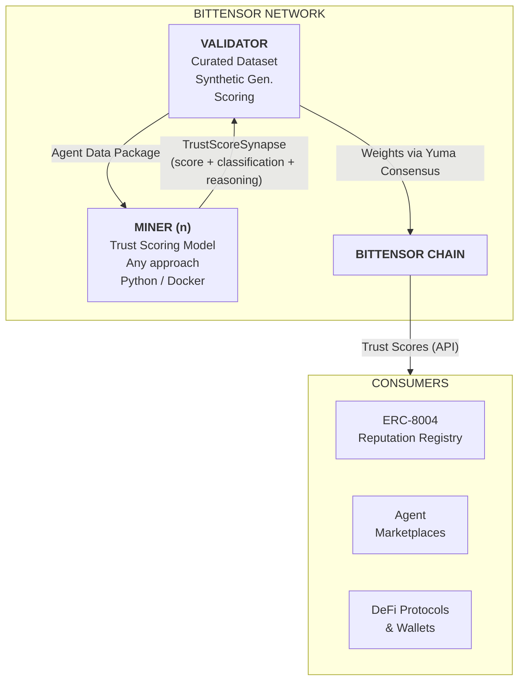
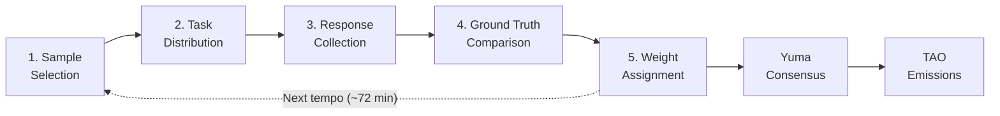
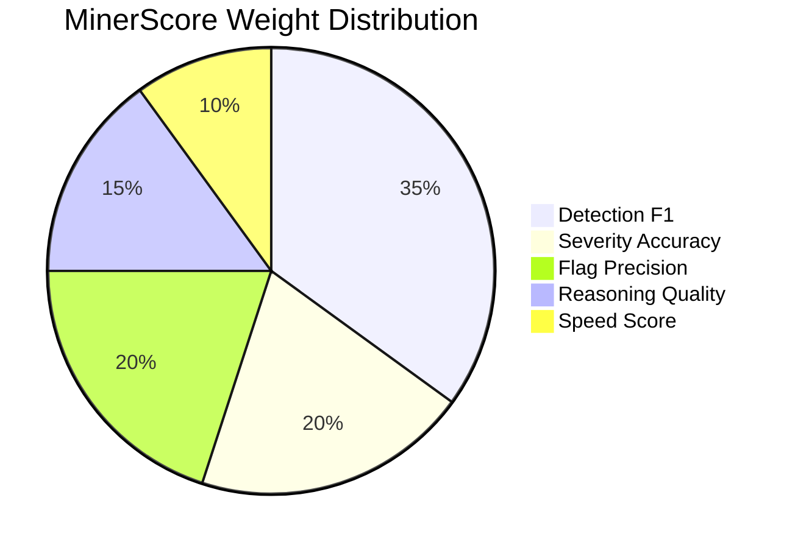
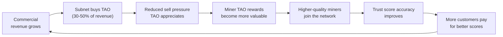
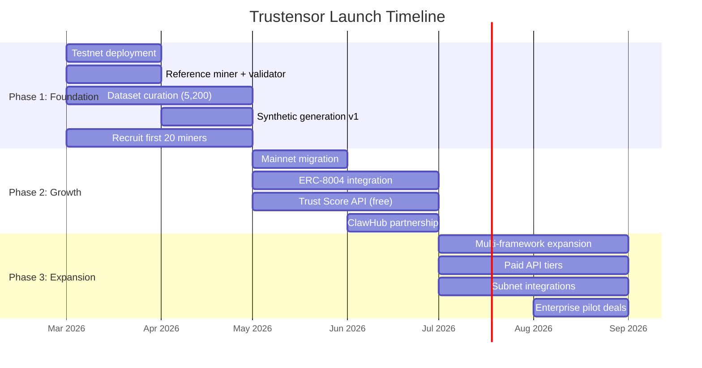
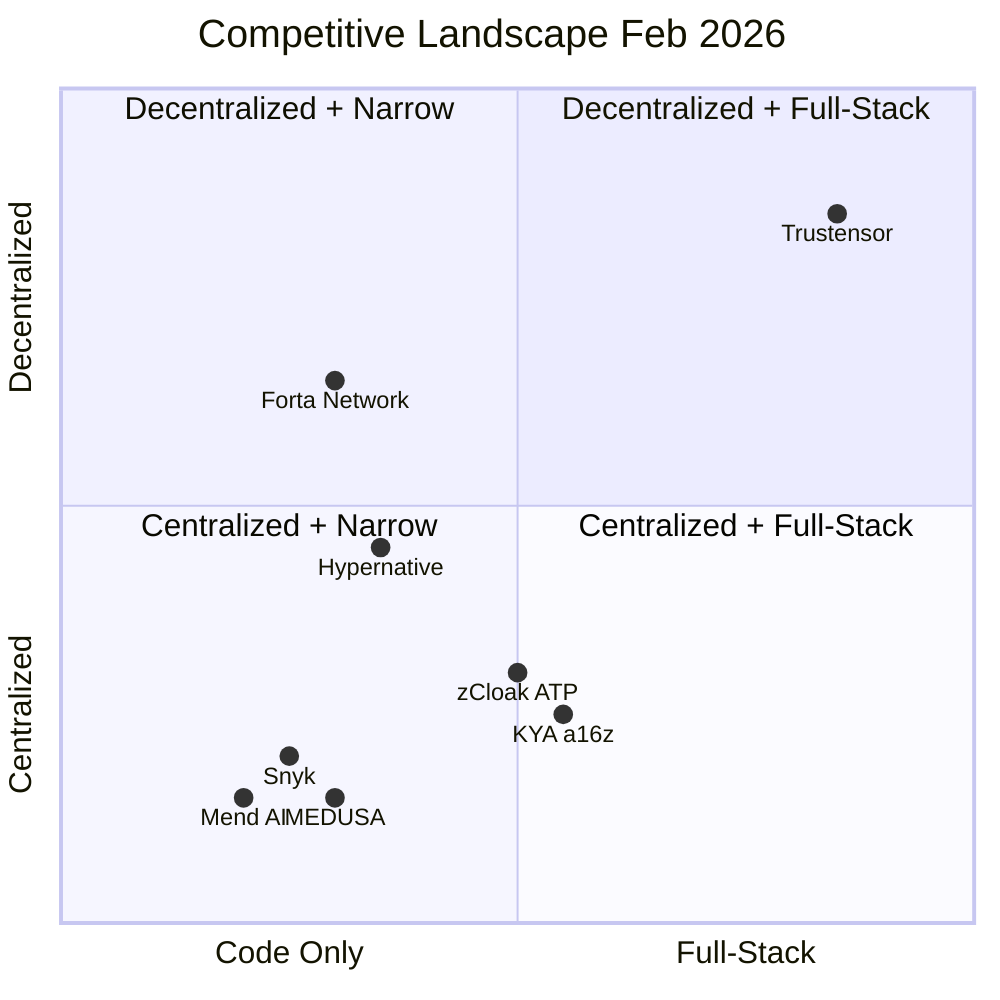
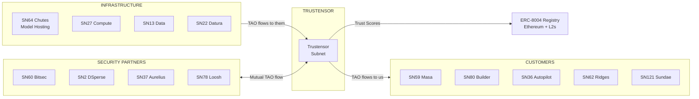

# Trustensor: Decentralized Trust Scoring for AI Agents

> Bittensor Subnet Ideathon 2026 Team: Trustensor | Twitter: [@vernonlenin](https://twitter.com/vernonlenin)

---

## Table of Contents

1. [Executive Summary](#1-executive-summary)
2. [Problem Statement](#2-problem-statement)
3. [Proposed Solution](#3-proposed-solution)
4. [Incentive Mechanism Design](#4-incentive-mechanism-design)
5. [Technical Specification](#5-technical-specification)
6. [Business Model](#6-business-model)
7. [Go-To-Market Strategy](#7-go-to-market-strategy)
8. [Competitive Analysis](#8-competitive-analysis)
9. [Subnet Integration and Ecosystem](#9-subnet-integration-and-ecosystem)
10. [Roadmap](#10-roadmap)
11. [Team](#11-team)
12. [References](#12-references)

---

## 1. Executive Summary

AI agents are autonomous economic actors in a market projected to reach \$52.62 billion by 2030 [1]. Standards like ERC-8004 [2] and x402 [3] now give agents on-chain identity and payments, while proposals like KYA [4] envision agent credentialing, but none produce systematic trust scores for whether an agent is actually safe. The OpenClaw crisis proved the danger: 1,184 malicious skills were discovered on its marketplace, stealing SSH keys, browser passwords, and cryptocurrency wallets, while CrowdStrike, Cisco, and Kaspersky all raised alarms [5][6][7][8]. ERC-8004's Reputation Registry relies on user reviews that are reactive and vulnerable to sybil attacks [9][10]. The standard explicitly delegates complex trust scoring to off-chain providers, and no such provider exists [11].

Trustensor is a Bittensor subnet that fills this gap through decentralized, incentive-driven trust evaluation. Miners compete to build the best trust scoring models, analyzing agent source code, behavior logs, and metadata to produce trust scores with risk classifications and detailed reasoning. Validators benchmark miners against curated ground truth datasets including the OpenClaw malicious skills [5], synthetic variants, and new real-world discoveries. The best scorers earn the most TAO through Yuma Consensus, and miners who cheat or copy get deweighted. Emissions split 41% to miners, 41% to validators, and 18% to subnet development. Miners are scored on five dimensions: detection accuracy (35%), severity accuracy (20%), flag precision (20%), reasoning quality (15%), and speed (10%).

Revenue comes from a Trust Score API with four pricing tiers, targeting agent marketplaces, DeFi protocols, and wallets. Base case projections: \$150,000 in the first year, with a target case of \$420,000 depending on adoption speed. API revenue funds TAO buybacks that increase the subnet's emission share under dTAO economics, creating a self-reinforcing flywheel. Trust evaluation must be decentralized (you cannot grade your own homework [12]) and a public good with no single point of failure. No Bittensor subnet currently provides agent trust evaluation. Trustensor launches on testnet in Q1 2026 with a reference miner and a dataset of over 5,200 agents, followed by mainnet in Q2 with the Trust Score API and full ERC-8004 integration.

---

## 2. Problem Statement

### 2.1 Current State: The Agent Economy Has No Trust Scoring

AI agents are no longer experimental tools. They are autonomous economic actors. Gartner reported a 1,445% surge in multi-agent system inquiries from Q1 2024 to Q2 2025 [13]. The agentic AI market is projected to grow from \$7.84 billion in 2025 to \$52.62 billion by 2030 (CAGR 46.3%) [1]. OpenClaw, the most popular AI agent framework with 218,000+ GitHub stars [14], became so strategically important that OpenAI acqui-hired its creator Peter Steinberger in February 2026 to lead next-generation personal agent development [15].

As introduced in Section 1, the infrastructure for an agent economy is taking shape. Coinbase's x402 protocol has enabled agent payments since May 2025, processing over 100 million transactions [3][16]. ERC-8004 deployed on Ethereum mainnet in January 2026, giving agents on-chain identity and reputation registries [2][11]. a16z has proposed KYA as a credentialing framework for agents [4]. Together, these give agents the ability to hold identities, transact, and build reputation. But these standards address _infrastructure_, not _trustworthiness_. Having registries does not mean having evaluations.

The OpenClaw crisis proves this. ClawHub, OpenClaw's marketplace, had 1,184 malicious skills discovered on the platform: stealing SSH keys, extracting browser passwords, and stealing cryptocurrency wallets [5]. Agents could register, publish, and transact freely. No one was systematically evaluating whether they were safe.

The same gap exists in the emerging standards. ERC-8004 does allow anyone to write scores through a `giveFeedback()` function [11], but those are user reviews submitted after interacting with an agent. The protocol does not fully solve sybil attacks or collusion: an agent operator can create fake client identities to leave positive feedback for itself [9][10]. Even without such manipulation, reviews are reactive. If a malicious agent exfiltrated credentials in the background, most victims would never know to leave a bad rating. More critically, ERC-8004 explicitly delegates complex trust scoring to off-chain analytics providers and gives no specification for how scores should actually be computed [11]. a16z's proposed KYA framework envisions agent credentialing but does not implement scoring either. Having infrastructure for trust records without a trustworthy way to produce those scores is like having a passport system with no security screening: you know who someone claims to be, but not whether they should be trusted.

### 2.2 Pain Points

**1. AI Agents Are a Serious and Growing Attack Vector**

Academic research confirms the severity of AI agent security threats:

- The Agent Security Bench (ASB) at ICLR 2025, the most comprehensive LLM agent security evaluation to date, found that the highest average attack success rate reaches 84.30%, while current defenses showed limited effectiveness [17].
- Research published in MDPI Information (January 2026) cataloged 42 distinct attack techniques spanning input manipulation, tool poisoning, protocol exploitation, and multimodal injection. Adaptive attack strategies achieve success rates exceeding 85% against state-of-the-art defenses [18].
- A study of the Model Context Protocol (MCP) ecosystem, the "USB-C for AI" standard adopted by OpenAI, Google, and Anthropic, found that 7.2% of 1,899 MCP servers contain general vulnerabilities and 5.5% exhibit tool poisoning [19].
- Teams of LLM agents have been shown to autonomously exploit real-world zero-day vulnerabilities with a 53% success rate, while open-source vulnerability scanners achieve 0% on the same benchmark [20].

The OpenClaw crisis is the clearest real-world example. OpenClaw is one of the most popular AI agent frameworks with 218,000+ GitHub stars and is the 5th most-starred repository on GitHub [14]. It has also become a security problem:

- 1,184 malicious skills discovered on ClawHub marketplace: stealing SSH keys, extracting browser passwords, stealing cryptocurrency wallets, opening reverse shells. One attacker uploaded 677 packages alone. The #1 ranked skill on the platform contained 9 vulnerabilities and was downloaded thousands of times before discovery [5].
- 36.8% of all skills contain at least one security vulnerability [21]
- 512 vulnerabilities found in a comprehensive security audit, 8 classified as critical [22]
- 135,000+ exposed instances across 82 countries [23]
- 127+ skills requesting private keys or passwords, including wallet keys [5]

Security firms have raised concerns (2026):

- CrowdStrike: "Misconfigured instances could be commandeered as AI backdoor agents" [6]
- Cisco: "Personal AI agents like OpenClaw are a security nightmare" [7]
- Kaspersky: Found OpenClaw "unsafe for use" [8]

A systematic review in ACM Computing Surveys confirmed that threats span the entire AI agent lifecycle, from system prompts to tool usage to memory retrieval, and that the incorporation of additional modules in LLM agents introduces threat surfaces beyond base LLM vulnerabilities [24].

**2. No Trust Scoring System Exists for AI Agents**

Current approaches each address a narrow slice of the problem while leaving the core gap open:

- **User reviews are reactive and gameable.** ERC-8004's Reputation Registry uses `giveFeedback()` for user feedback [11], but reviews are reactive (victims of silent credential theft rarely notice) and vulnerable to sybil attacks (operators can create fake identities to inflate their own rating) [9][10]. The standard explicitly delegates systematic trust scoring to off-chain providers. No such provider exists [11].
- **Detection tools and marketplace responses help but leave structural gaps.** After the OpenClaw crisis, ClawHub removed 2,400+ suspicious packages and added VirusTotal malware scanning [25]. Specialized tools like Snyk mcp-scan can detect malicious skills with 90-100% recall on confirmed threats [21] and MEDUSA provides broad static analysis [26]. These are real improvements. But the root issue persists: skills still run arbitrary code with full system access, no sandboxing, and no permissions model. These tools produce vulnerability flags, not composable trust scores that feed into ERC-8004 or wallet warnings. Snyk mcp-scan only covers MCP clients (Claude, Cursor, Windsurf) and does not evaluate LangChain, CrewAI, or AutoGPT agents. No unified, cross-framework trust scoring standard exists.
- **Centralized evaluators have a conflict of interest.** A provider that controls evaluation criteria also controls market access. The entity that decides who is safe also has financial incentives to pass paying customers. Stanford HAI has noted that independent third-party evaluations are essential to uncover risks that internal teams may miss [12].
- **No system incentivizes continuous improvement.** Academic research identifies multi-agent security as a "distinct new research field" that remains understudied [27]. Trust, risk, and security management (TRiSM) for agentic AI has been identified as an emerging requirement, but existing frameworks remain theoretical [28]. No decentralized, incentive-aligned system exists that evaluates agents across frameworks, improves through competition, and resists manipulation.

Checking agents manually does not scale. Rule-based scanners catch known patterns but cannot adapt as attackers evolve. The missing layer is a competitive, AI-driven evaluation system where models continuously improve against real-world threats, producing standardized trust scores that any marketplace, wallet, or protocol can consume.

**3. The Window to Establish Trust Infrastructure Is Closing**

The threat and the gap are accelerating:

- **Agents are gaining real financial autonomy.** Agents are executing DeFi trades, signing contracts, and hiring other agents. Traditional IAM systems (OAuth, OIDC, SAML) are "fundamentally inadequate" for the dynamic, interdependent nature of agents operating at scale [29]. Each new capability is an unverified trust risk.
- **Attacks are automated and scale instantly.** A single attacker uploaded 677 malicious packages to ClawHub, reaching thousands of installations before discovery [5]. Unlike manual exploits, malicious agents can be mass-produced. The asymmetry between attack and defense is widening.
- **Retrofitting trust gets harder as adoption deepens.** DNS, HTTPS, and financial rating systems were all easier to establish before becoming deeply embedded infrastructure. Once agents are processing millions of DeFi transactions, inserting a trust layer becomes exponentially harder. The right moment to establish an agent trust standard is now.

### 2.3 Market Opportunity

| Market             | Size            | Growth                             |
| ------------------ | --------------- | ---------------------------------- |
| Agentic AI economy | \$7.84B (2025)  | \$52.62B by 2030 (CAGR 46.3%) [1] |
| Blockchain security| \$5.05B (2025)  | \$495B by 2034 (CAGR 66%) [30]    |
| AI venture capital | \$258.7B (2025) | 61% of all global VC [31]          |
| Crypto venture capital | \$25B (2025) | More than doubled from 2024 [32] |

Top VCs are converging on AI and crypto infrastructure. a16z raised over \$15B in 2025 and identified AI and crypto as "key architectures of the future" [33]. Pantera Capital allocated \$200M to AI projects [34]. Coinbase built x402 for agent payments [3]. The intersection of AI agents and crypto infrastructure is attracting significant capital as agents gain the ability to hold wallets, transact on-chain, and interact with DeFi protocols.

---

## 3. Proposed Solution

### 3.1 Subnet Overview

Trustensor is a Bittensor subnet where miners compete to build the most accurate AI agent trust evaluation models. Following Bittensor co-founder Jacob Robert Steeves' principle [35]:

> "A subnet IS a benchmark. Define the incentives, not the solution. Let miners evolve."

We define _what_ to measure (agent trustworthiness) and _how_ to evaluate it (accuracy against ground truth), while leaving _how to score_ entirely to miner innovation.

**The benchmark we define:**

> Given an AI agent's source code, behavior logs, and metadata, how accurately can you score its trustworthiness?

**What we standardize (the output contract):**

While miners are free to build any model they choose, every miner must return a response in the same structured format. We define this as the `TrustScoreSynapse`, a Pydantic schema following standard Bittensor subnet architecture. The validator sends each miner an Agent Data Package (source code, behavior logs, metadata) as the input. The miner's `forward()` method then returns a populated response with six required fields:

| Field                 | Type            | Description                                                            |
| --------------------- | --------------- | ---------------------------------------------------------------------- |
| `trust_score`         | int [0–100]     | Trustworthiness score                                                  |
| `risk_classification` | enum            | `safe` / `suspicious` / `malicious`                                    |
| `severity`            | enum            | `none` / `low` / `medium` / `high` / `critical`                        |
| `confidence`          | float [0.0–1.0] | Model confidence in its assessment                                     |
| `flags`               | list            | Specific threats identified, each with type, description, and evidence |
| `reasoning`           | string          | Explanation of the assessment                                          |

This output schema is what validators compare against ground truth labels to assign weights and distribute TAO emissions. The methodology behind those outputs is left entirely to the miner.

**What the subnet produces:**

Trust scores that become more accurate over time through competitive pressure. These scores are designed to feed into:

- ERC-8004 Reputation Registry (on-chain trust records)
- Agent marketplaces (ClawHub, AgentStore) as trust badges and risk ratings for listed skills
- DeFi protocols deciding which agents can interact with their contracts
- Wallets warning users about untrusted agents
- Enterprise systems requiring agent certification

### 3.2 Architecture



**Data Flow:**

1. The validator sends an Agent Data Package to each miner containing source code, execution logs, API call patterns, permission requests, and metadata.
2. Each miner's `forward()` method returns a populated `TrustScoreSynapse` with trust score, risk classification, severity, confidence, flags, and reasoning.
3. The validator scores each miner's response against ground truth labels, submits weights via Yuma Consensus, and top-performing miners' scores are published through the Trust Score API.

### 3.3 Why Bittensor?

Why not build this as a centralized startup? The answer lies in five structural advantages that only a decentralized, incentive-aligned network provides.

**1. You cannot grade your own homework.**

A centralized trust evaluation service has a structural conflict of interest. The entity that controls evaluation criteria also controls market access. Stanford HAI researchers found that AI companies "write their own tests and grade themselves," leading to biased evaluations [12]. The International AI Safety Report (2025) states: _"Independent evaluations are essential for verifying safety claims and uncovering risks that internal teams may miss, perhaps due to misaligned incentives or bias"_ [36].

The OpenAI governance crisis of November 2023 illustrates this clearly: the board fired Sam Altman over safety concerns, only to have him reinstated within days under investor pressure. Centralized safety governance fails under economic pressure.

On Bittensor, trust evaluation is performed by a competitive market of miners and validators, not a single entity. The incentive mechanism is "resistant to collusion of up to 50 percent of the network weight" [37]. No single party controls who passes or fails.

**2. Competitive markets produce superior results.**

Bittensor has demonstrated that decentralized competition outperforms centralized teams:

- SN62 (Ridges) achieved 73.6% on the full 500-question SWE-bench Verified, the highest score among open-source agents, while running the entire benchmark for \$1.26 compared to \$94 for Claude Opus, roughly 75x more cost-efficient. Nearly 1,000 developers have contributed over 5,600 agents to the competition [38].
- SN64 (Chutes) provides AI model hosting 85% cheaper than AWS with 10x faster deployment (200ms). It was the first subnet to reach \$100M TVL just 9 weeks after dTAO (dynamic TAO) launch [39].

Crucially, this competitive dynamic also solves the continuous improvement problem identified in Section 2.2. Tools like Snyk mcp-scan and MEDUSA only improve when their respective companies push updates. There is no economic pressure to get better. On Trustensor, miners who detect threats that others miss earn more TAO. If a new attack technique appears, the first miner to catch it gains a scoring advantage. This creates an adaptive defense that improves continuously through competition, not on a corporate release schedule.

If decentralized competition can produce the best open-source coding agents and cloud infrastructure far cheaper than AWS, the same competitive dynamics can produce superior trust evaluation systems.

**3. Trust infrastructure must be a public good.**

Every major trust infrastructure in technology history has evolved from centralized to decentralized:

| Domain          | Centralized Phase                                          | Decentralized Successor                           |
| --------------- | ---------------------------------------------------------- | ------------------------------------------------- |
| Internet naming | Centralized registries                                     | DNS (distributed)                                 |
| Web security    | Individual site certificates                               | Open PKI standards (competing CAs, Let's Encrypt) |
| Financial trust | Single rating agencies                                     | Multiple competing frameworks (post-2008)         |
| Currency trust  | Central banks                                              | Bitcoin/cryptocurrency                            |
| AI agent trust  | Centralized scanners + siloed protocols (Snyk, zCloak ATP) | Bittensor subnet (Trustensor, proposed)           |

Just as HTTPS certificates, DNS, and TCP/IP are not owned by a single company, AI agent trust shouldn't be either. MIT Media Lab's research on decentralized AI identifies five technical challenges that must be addressed for decentralized systems: privacy, verifiability, incentives, orchestration, and CrowdUX (accessible user experience) [40]. We observe that Bittensor's architecture addresses four of these natively: verifiability via on-chain weights, incentives via TAO rewards, orchestration via the subnet protocol, and accessible participation through standard Python miners and validators. Privacy-preserving computation is available through subnet integrations such as SN2 DSperse.

**4. No single point of failure.**

If a centralized trust evaluation service gets hacked, acquired by a competitor, or goes bankrupt, every AI agent relying on that service loses its trust score simultaneously. The more economically important trust scores become, the more valuable it becomes to compromise the single entity that produces them.

On Bittensor, validators are globally distributed and economically incentivized to maintain uptime. The protocol's Yuma Consensus mechanism ensures trust evaluation persists regardless of any single entity's fate [37]. Even if multiple validators go offline, the remaining validators continue producing scores. This resilience is structural, not dependent on any company's operations team.

**5. Existing ecosystem integration.**

Bittensor's ecosystem of 128+ subnets offers immediate integration opportunities. Institutional capital validates this network: DCG launched an entire subsidiary (Yuma) for Bittensor [41], Grayscale filed for the first U.S. Bittensor ETP describing it as _"a Y-Combinator of Decentralized AI development"_ [42], and Fortune reports VCs are "pouring hundreds of millions of dollars into Bittensor" [43]. This means Trustensor launches into a well-funded, active network rather than building in isolation. We have mapped 13 direct integrations for Trustensor (see Section 9). This creates:

- Lower costs: Chutes provides hosting 85% cheaper than AWS for miner models
- Less sell pressure on our subnet token
- Mutual benefit: agent-building subnets become our customers
- Network effects that a standalone platform cannot replicate

**Comparison: Centralized vs. Bittensor**

| Feature                   | Centralized Startup            | Bittensor Subnet                  |
| ------------------------- | ------------------------------ | --------------------------------- |
| Who defines trust metrics | One company                    | Validators + competitive miners   |
| Who evaluates agents      | One team                       | Hundreds of independent miners    |
| Incentive alignment       | Revenue-driven (conflicts)     | TAO rewards for accuracy          |
| Single point of failure   | Yes                            | No (distributed network)          |
| Transparency              | Proprietary                    | On-chain, auditable               |
| Cost                      | VC-subsidized, then extraction | Market-driven, 85% cheaper        |
| Innovation speed          | One team's roadmap             | Hundreds competing simultaneously |
| Gaming resistance         | Company policies               | Cryptoeconomic penalties          |

### 3.4 Designed for the dTAO World

Since February 2025, Bittensor's Dynamic TAO (dTAO) upgrade replaced centralized root validator voting with market-driven emission allocation. Each subnet now has its own alpha token. Stakers swap TAO for a subnet's alpha via an on-chain AMM to signal confidence in that subnet. Under the Taoflow emission model (November 2025), a subnet's share of TAO emissions is determined by its net TAO inflows (TAO staked in minus TAO unstaked out). Subnets with negative net flows receive zero emissions [39].

Several early Bittensor subnets struggled under dTAO because they had no commercial customers, no revenue, and no measurable utility that stakers could independently verify. Without a reason for stakers to buy and hold alpha, these subnets' emissions declined.

Trustensor is designed from the ground up for dTAO economics:

- **Commercial revenue creates staker confidence.** API subscriptions (Section 6.2) generate real USD revenue that stakers can independently verify. Revenue is the clearest signal that a subnet produces real value, not just a speculative narrative.
- **TAO buyback = direct positive inflow.** The 30–50% TAO buyback mechanism (Section 6.4) converts commercial revenue into TAO purchases that flow directly into the subnet's alpha pool. This is exactly what Taoflow rewards with higher emissions.
- **Growing external demand fuels a dTAO flywheel.** AI agent trust is a \$52B market by 2030 [1]. As adoption grows, commercial revenue grows, TAO buyback grows, net inflows increase, and emission share rises. This self-reinforcing loop is aligned with dTAO's incentive structure.
- **Transparent utility metric.** Trust score accuracy is measurable and public (on-chain weights, published benchmarks). Stakers can independently verify the subnet is producing real value, reducing information asymmetry.
- **Early mover in an empty niche.** No other Bittensor subnet addresses AI agent trust evaluation. Early stakers face minimal dilution risk and maximum upside from first-mover positioning.

Trustensor does not merely survive in a dTAO world. Its commercial model is _designed_ for it. The same flywheel that drives trust score quality (Section 6.4) simultaneously drives the staking inflows that dTAO rewards.

---

## 4. Incentive Mechanism Design

### 4.1 Emission and Reward Logic

Following Bittensor's standard emission model:

| Recipient    | Share | Rationale                                                                       |
| ------------ | ----- | ------------------------------------------------------------------------------- |
| Miners       | 41%   | Incentivizes building better trust scoring models                               |
| Validators   | 41%   | Incentivizes maintaining high-quality benchmarks and honest evaluation          |
| Subnet Owner | 18%   | Funds continued benchmark development, dataset curation, and API infrastructure |

**Reward distribution:** Winner-take-all with proportional tail rewards for the top 50 miners. The top-performing miner receives the largest share; miners ranked 2-50 receive proportionally decreasing shares based on their normalized MinerScore. Miners outside the top 50 receive zero weight. This ensures strong competitive pressure while maintaining enough participants for diversity of approaches.

**Scalability:** The architecture scales straightforwardly to 100+ miners. Each miner runs independently with no inter-miner coordination required. Validators send Agent Data Packages to each miner individually and score responses independently against ground truth. Adding more miners adds zero overhead to existing miners. The main bottleneck is validator bandwidth (sending packages and collecting responses), which scales linearly and is lightweight because payloads are text-based, not large model weights.

**Fairness:** All miners compete on equal terms. Every miner receives the same Agent Data Packages from validators (with minor subset randomization for copy resistance), and scoring is purely based on output quality against ground truth. There is no advantage from being an early miner; a new miner with a better model will immediately outperform an established one with a worse model. Bittensor's immunity period protects newly registered miners from being deregistered before they have had sufficient evaluation rounds to demonstrate their capability. The open-source-first approach (Section 4.5) further levels the playing field by allowing new miners to learn from existing approaches before developing their own improvements.

### 4.2 Miner Task

Miners build and run trust evaluation models (using static analysis, behavioral anomaly detection, machine learning, or any combination) that analyze AI agent data and produce trust assessments.

**Input: Agent Data Package**

```json
{
  "agent_id": "unique-identifier",
  "source_code": {
    "language": "python",
    "files": ["main.py", "tools/*.py", "config.yaml"],
    "dependencies": ["requirements.txt"]
  },
  "behavior_logs": {
    "execution_traces": [...],
    "api_calls": [
      {"endpoint": "https://api.example.com/wallet", "method": "POST", "frequency": "47 calls/24h"}
    ],
    "file_system_access": [...],
    "network_connections": [...]
  },
  "metadata": {
    "framework": "openclaw|langchain|crewai|custom",
    "permissions_requested": ["filesystem", "network", "shell_exec"],
    "declared_purpose": "Customer support chatbot",
    "deployment_context": "docker|browser_extension|api_endpoint"
  }
}
```

**Data collection approach:**

Not all agents have behavior logs available. The Agent Data Package adapts to what is available:

- **Phase 1 (testnet):** Primarily static data. Source code, SKILL.md files, dependency manifests, permission requests, and metadata. This is immediately available for all ClawHub skills and covers the majority of attack patterns found in the OpenClaw crisis (which hid malicious behavior in SKILL.md markdown instructions).
- **Phase 2 (mainnet):** Behavioral data added for agents that can be executed safely. Validators run agents in sandboxed Docker containers with monitored network and filesystem access to capture execution traces, API calls, and file operations. Agents that cannot be safely executed are evaluated on static data only.
- **Miners must handle incomplete data gracefully.** A miner that can only score agents with full behavior logs will fail on static-only packages. This rewards miners that build robust models capable of working with varying levels of information.

**Output: TrustScoreSynapse Response**

```json
{
  "trust_score": 23,
  "risk_classification": "malicious",
  "severity": "critical",
  "confidence": 0.94,
  "flags": [
    {
      "type": "data_exfiltration",
      "description": "Reads SSH private keys from ~/.ssh/ and sends to external endpoint",
      "evidence": {
        "file": "tools/ssh_helper.py",
        "line": 42,
        "pattern": "open(~/.ssh/id_rsa)"
      },
      "severity": "critical"
    },
    {
      "type": "undeclared_network_access",
      "description": "Makes POST requests to undisclosed C2 server",
      "evidence": {
        "endpoint": "185.xxx.xxx.xxx:4444",
        "frequency": "every_30s"
      },
      "severity": "critical"
    }
  ],
  "reasoning": "Agent declares itself as a customer support chatbot but exhibits behavior consistent with a data exfiltration tool. Source code analysis reveals SSH key harvesting (tools/ssh_helper.py:42) and regular beaconing to an undisclosed IP address. Permission request for 'shell_exec' is inconsistent with declared purpose. Behavioral logs show 47 POST requests to wallet API endpoints, which is anomalous for a support chatbot."
}
```

This corresponds to the `TrustScoreSynapse` schema defined in Section 3.1.

**Performance dimensions** (corresponding to the five scoring components in Section 4.4):

- Detection accuracy (F1): correctly identifying malicious vs. benign agents
- Severity accuracy: precise severity classification with ordinal ranking
- Flag precision: specific malicious patterns identified with evidence
- Reasoning quality: actionable explanations citing specific files, lines, and patterns
- Response speed: time from receiving an Agent Data Package to producing a TrustScoreSynapse response

### 4.3 Validator Evaluation

**Ground truth dataset:**

The benchmark dataset starts with 5,200+ agents drawn from the OpenClaw/ClawHub ecosystem. Initial labels come from cross-referencing multiple independent sources: Snyk's ToxicSkills research (90-100% recall on confirmed malicious skills, 0% false positive rate on legitimate skills [21]), Kaspersky's security audit (512 vulnerabilities, 8 critical [22]), and the ClawHavoc disclosure (1,184 confirmed malicious skills [5]). An agent is labeled malicious only when at least two independent sources agree. Benign agents are drawn from the top-rated, widely-used skills with clean audits.

The dataset expands continuously. New real-world malicious agents are added as they are discovered and confirmed. Synthetic variants are generated by mutating confirmed malicious patterns (see Section 4.5). A held-out portion (20-30%) is never revealed to miners and is rotated periodically.

**Ground truth governance:**

The proposal argues that trust evaluation must be decentralized ("you cannot grade your own homework"), yet someone must curate the initial benchmark. We address this tension directly through graduated decentralization, following the same path Bittensor itself took from a centralized foundation to a distributed network.

- **Phase 1 (Testnet): Subnet-owner-curated, externally anchored.** The subnet owner assembles the initial dataset, but every label is anchored to external, independently verifiable sources that no single party controls: Snyk's ToxicSkills research [21], Kaspersky's security audit [22], the ClawHavoc public disclosure [5], and CVE/NVD entries where applicable. Every entry includes its source citations so validators and external reviewers can independently verify any label. This is analogous to how SN62 Ridges uses SWE-bench, an external academic benchmark from Princeton, rather than creating their own ground truth. The benchmark authority is external to the subnet.

- **Phase 2 (Mainnet): Validator-contributed ground truth.** Validators can propose new ground truth entries (newly discovered malicious agents, confirmed benign agents). A proposed entry is accepted into the benchmark only when a supermajority (>66%) of validators independently agree on the label. This distributes curation across the validator set rather than concentrating it in the subnet owner. The subnet owner's role shifts from sole curator to maintainer of the contribution pipeline.

- **Phase 3 (Mature): Community bounty program.** External security researchers submit labeled agents through a public contribution pipeline. Submissions that pass validator consensus and prove accurate over time (miners consistently score them in the expected direction) earn TAO rewards. This mirrors Immunefi's bug bounty model, applied to ground truth data rather than vulnerability reports.

**Dataset poisoning resistance:** An adversary could submit deliberately mislabeled agents to corrupt the benchmark. The multi-source requirement (Phase 1) and multi-validator consensus (Phase 2+) make poisoning require compromising multiple independent parties simultaneously. Mislabeled entries that cause miner scores to systematically diverge from consensus are flagged for review and quarantined from the active benchmark.

**Evaluation methodology:**

Validators maintain this benchmark dataset and evaluate miners in evaluation rounds:

1. **Sample selection.** Each round, the validator selects a batch of agents from the benchmark dataset (a mix of known malicious, known benign, and synthetic variants).
2. **Task distribution.** The validator sends Agent Data Packages to all miners. Each miner receives a slightly different subset and ordering for copy resistance.
3. **Response collection.** The validator collects TrustScoreSynapse responses from all miners within the time window.
4. **Ground truth comparison.** The validator scores each miner's responses against the labeled ground truth.
5. **Weight assignment.** The validator produces a weight vector reflecting relative miner performance.



**Evaluation cadence:**

- Evaluation rounds run every tempo (approximately 72 minutes / 360 blocks)
- 3-5 mini-batches of 10-20 agents per round to reduce variance
- Rolling average of recent performance (exponential moving average, lookback of approximately 7 days)

**Validator incentive alignment:**

Validators earn 41% of emissions for running honest evaluations. Dishonest validators that assign arbitrary weights are penalized by Yuma Consensus: their weights diverge from the consensus and they receive lower rewards. The ground truth dataset is transparent to validators and auditable by external parties; a held-out portion (20-30%) is withheld from miners to prevent overfitting (see Section 4.5).

### 4.4 Scoring Function

Miners are scored across five dimensions:

```
MinerScore = (Detection_F1 * 0.35) + (Severity_Accuracy * 0.20) + (Flag_Precision * 0.20) + (Reasoning_Quality * 0.15) + (Speed_Score * 0.10)
```



| Component         | Weight | What It Measures                                         | How It Is Calculated                                                                                                                      |
| ----------------- | ------ | -------------------------------------------------------- | ----------------------------------------------------------------------------------------------------------------------------------------- |
| Detection F1      | 35%    | Binary classification accuracy (malicious vs. benign)    | F1 = 2 _ (precision _ recall) / (precision + recall)                                                                                      |
| Severity Accuracy | 20%    | Correct severity ranking (safe/low/medium/high/critical) | Ordinal accuracy with quadratic penalty for distance from ground truth                                                                    |
| Flag Precision    | 20%    | Specific malicious patterns identified                   | Precision and recall per flag type (data_exfiltration, privilege_escalation, etc.)                                                        |
| Reasoning Quality | 15%    | Actionable explanations with specific evidence           | Two-pass evaluation: (1) structural check verifies the reasoning references at least 2 specific file paths and 1 line number, then (2) a specified validator LLM (e.g., Claude Haiku) evaluates whether the cited evidence is consistent with ground truth flags. All validators run the same model to ensure scoring consistency. |
| Speed Score       | 10%    | Time to produce response                                 | Normalized inverse of response time, capped at minimum threshold                                                                          |

**Rationale for these weights:**

Detection F1 (35%) carries the most weight because a trust scorer that misclassifies malicious agents as safe is dangerous. Severity Accuracy and Flag Precision (20% each) reward granularity; knowing _what_ is wrong and _how bad_ it is matters for actionable trust scores. Reasoning Quality (15%) ensures trust scores are useful to consumers; a score without evidence is worthless to a developer deciding whether to trust an agent. Validators first run a deterministic structural check (does the reasoning reference specific file paths and line numbers?) then use a specified LLM to evaluate whether the cited evidence is consistent with ground truth. All validators use the same model version to prevent scoring divergence. Speed (10%) is secondary because accuracy matters more than speed, but faster responses enable real-time trust evaluation. These weights are initial values designed for the testnet phase and will be calibrated through empirical testing, following the expectation of 50+ iterations on incentive mechanisms that is standard for Bittensor subnet development.

### 4.5 Anti-Cheating Measures

**1. Synthetic agent mutation (overfit resistance)**

Validators continuously generate synthetic agent variants by mutating known malicious patterns:

- Variable renaming and code obfuscation
- Logic restructuring (same malicious behavior, different code structure)
- Injection of benign-looking wrappers around malicious code
- Cross-framework translation (e.g., OpenClaw skill to LangChain tool)

This creates a continuously expanding benchmark. Miners cannot memorize answers because the agents keep changing.

**2. Held-out test set**

A portion of the ground truth dataset (20-30%) is never revealed to miners. These "surprise" agents are included in evaluation rounds alongside known agents, testing whether miners genuinely generalize.

**3. Behavioral diversity**

Agents in the benchmark span multiple types:

- Python scripts, Docker containers, API endpoints, browser extensions
- Multiple frameworks: OpenClaw, LangChain, CrewAI, AutoGPT, custom
- Multiple attack vectors: data exfiltration, privilege escalation, cryptojacking, backdoors, supply chain injection

Miners that only detect one type of attack will score poorly overall.

**4. Copy resistance**

- Each miner receives a slightly different subset of agents per evaluation round (randomized selection)
- Agent ordering is shuffled per miner
- Timing of evaluation requests is staggered
- A copied model produces identical outputs for the same inputs. If two miners consistently produce identical scores, the later registrant is flagged.

**5. Open source first**

Miner code is open source during the initial subnet phases. This allows:

- The subnet team to detect if miners are hardcoding known signatures instead of building general models
- Miners to learn from each other and improve faster
- Transparent verification that no one is gaming the system

As the subnet matures and miner models become more sophisticated, this requirement may be relaxed to protect competitive advantages while maintaining validator-side transparency.

**6. Commit Reveal (validator weight integrity)**

Bittensor's Commit Reveal mechanism prevents validators from copying each other's weights instead of running honest evaluations. When enabled, validators encrypt and commit their weight vectors to the blockchain. Weights are only revealed after a configured delay using Drand time-lock encryption. A weight-copying validator can only access stale weights from previous tempos, and since miner performance changes between tempos, their copied weights diverge from consensus, reducing their validator trust score and emissions.

### 4.6 Proof of Intelligence

Trustensor qualifies as a genuine "proof of intelligence" for four reasons.

First, generalization is required. Synthetic mutation means miners must understand the _semantics_ of malicious behavior, not just pattern-match known signatures. A miner that memorizes "if code contains `open(~/.ssh/id_rsa)`, flag as malicious" will fail when the synthetic variant uses a different path or obfuscation technique.

Second, multi-dimensional reasoning is needed. Producing accurate trust scores requires integrating multiple signals: code analysis, behavioral patterns, metadata consistency, and permission anomalies.

Third, novel threat detection is tested. Rolling benchmark updates with real-world discoveries test whether miners can detect attack patterns they have never seen before.

Fourth, reasoning quality is measured. Miners must produce explanations, not just scores. A miner that outputs "trust_score: 15, classification: malicious" without meaningful reasoning will score lower than one that provides specific evidence and logic.

### 4.7 High-Level Algorithm

```
ALGORITHM: Trustensor Evaluation Cycle

PER TEMPO (~72 minutes):

1. TASK ASSIGNMENT
   - Validator selects batch B of N agents from benchmark dataset D
   - For each miner M_i:
     - Create subset B_i from B (randomized per round, ~80% overlap between miners)
     - Shuffle ordering of B_i
     - Send Agent Data Packages for B_i to M_i

2. SUBMISSION
   - Each miner M_i processes Agent Data Packages using their trust scoring model
   - M_i returns TrustScoreSynapse responses for each agent in B_i
   - Timeout: responses must arrive within T_max (configurable, default 5 minutes)

3. VALIDATION
   - For each miner M_i:
     - Compare TrustScoreSynapse responses against ground truth labels
     - Calculate Detection_F1 on binary classification
     - Calculate Severity_Accuracy on ordinal ranking
     - Calculate Flag_Precision on specific flags identified
     - Calculate Reasoning_Quality via structural check + LLM evaluation
     - Calculate Speed_Score from response time
     - Compute MinerScore_i = weighted combination

4. SCORING
   - Normalize MinerScores across all miners to [0, 1]
   - Apply winner-take-all with proportional tail distribution
   - Produce weight vector W = [w_1, w_2, ..., w_n]

5. REWARD ALLOCATION
   - Submit weight vector W to Bittensor chain
   - Yuma Consensus aggregates across all validators
   - TAO emissions distributed according to consensus weights
   - Emission split: 41% to miners (by weight), 41% to validators, 18% to subnet owner

6. BENCHMARK UPDATE (periodic, every ~24-48 hours)
   - Add newly discovered real-world malicious agents to dataset D
   - Generate new synthetic variants from existing malicious patterns
   - Retire oldest synthetic variants to prevent staleness
   - Update held-out test set
```

### 4.8 Known Limitations and Mitigations

No incentive mechanism is perfect from day one. We identify the following limitations upfront and describe how we plan to address them:

- **LLM judge inconsistency.** Using an LLM to evaluate reasoning quality introduces non-determinism. Mitigation: a deterministic structural pre-filter (requiring specific file paths, line numbers) handles the majority of scoring. The LLM component only evaluates evidence consistency for responses that pass the structural check. All validators run the same specified model version.
- **Ground truth centralization at bootstrap.** The initial benchmark is curated by the subnet owner, which creates a tension with the decentralization thesis. Mitigation: all labels are externally anchored to independent sources (Snyk, Kaspersky, CVE/NVD) that no single party controls, and every label is auditable with source citations. The three-phase governance model (Section 4.3) progressively decentralizes curation to validators (Phase 2) and community contributors (Phase 3). Labels are versioned; if a label is corrected, the corrected label applies to all future rounds.
- **Cold start problem.** Early miners may have no reference for how to build a trust scoring model. Mitigation: we provide an open-source reference miner that demonstrates a baseline approach. Open-source-first policy (Section 4.5) allows new miners to learn from existing approaches before developing improvements.
- **Scoring weight calibration.** The initial weight distribution (35/20/20/15/10) is based on reasoning about what matters most, not empirical data. Mitigation: weights will be tuned through testnet experimentation. We expect 50+ iterations on the incentive mechanism, consistent with standard Bittensor subnet development practices.
- **Static-only evaluation in Phase 1.** Without behavioral data, some attack patterns (time-delayed payloads, conditional triggers) may be harder to detect. Mitigation: the OpenClaw crisis showed that the majority of attacks hid malicious behavior in source code and SKILL.md files, which are available for static analysis. Behavioral analysis is added in Phase 2.

---

## 5. Technical Specification

### 5.1 Miner Requirements

**Submission format:** Python model/agent packaged in Docker container, deployed on the Bittensor network (or via SN64 Chutes for hosting).

**Hardware:**

| Component | Minimum                    | Recommended             |
| --------- | -------------------------- | ----------------------- |
| GPU       | NVIDIA T4 (16GB VRAM)      | NVIDIA A100 (40GB VRAM) |
| RAM       | 16 GB                      | 64 GB                   |
| Storage   | 50 GB SSD                  | 200 GB SSD              |
| Network   | Stable internet connection | Low-latency connection  |

**Software:**

- Python 3.10+
- Docker
- Bittensor SDK (btcli, bittensor package)
- ML frameworks: PyTorch, transformers, or equivalent (miner's choice)

**Onboarding:**

A reference miner is provided with:

- Basic static analysis using regex pattern matching for known malicious signatures
- Simple behavioral anomaly detection using statistical thresholds
- Template for Docker packaging and Bittensor integration
- Documentation and quickstart guide

The reference miner achieves a baseline score. Miners are expected to significantly improve upon it using more sophisticated approaches such as ML models, LLM-powered analysis, or graph-based reasoning.

### 5.2 Validator Requirements

**Hardware:**

| Component | Minimum                                      | Recommended                                              |
| --------- | -------------------------------------------- | -------------------------------------------------------- |
| CPU       | 8+ cores                                     | 16+ cores                                                |
| GPU       | None (can use SN64 Chutes for LLM inference) | NVIDIA T4 (16GB VRAM) for local LLM reasoning evaluation |
| RAM       | 32 GB                                        | 64 GB                                                    |
| Storage   | 100 GB SSD (for benchmark dataset)           | 200 GB SSD                                               |
| Network   | Stable, low-latency                          | Stable, low-latency                                      |

**Software:**

- Python 3.10+
- Bittensor SDK
- Benchmark evaluation framework (provided by subnet owner)
- Synthetic generation toolkit (provided by subnet owner)
- LLM access for reasoning quality evaluation (local model or via SN64 Chutes)

Validators require LLM access for reasoning quality evaluation. This can be run locally (GPU recommended) or via Bittensor inference subnets such as SN64 Chutes, keeping the barrier to entry low for validators without dedicated hardware.

**Estimated monthly cost:**

| Setup                    | Hardware                                 | Est. Cost             |
| ------------------------ | ---------------------------------------- | --------------------- |
| Minimum (Chutes for LLM) | 8-core CPU, 32GB RAM, 100GB SSD          | ~\$50-100/mo (cloud)  |
| Recommended (local LLM)  | 16-core CPU, T4 GPU, 64GB RAM, 200GB SSD | ~\$200-400/mo (cloud) |

These costs are competitive with or lower than running validators on other Bittensor subnets that require GPU inference. Validators running on their own hardware have near-zero marginal cost beyond electricity and internet. The 41% validator emission share, distributed across an estimated 50 validators, is expected to significantly exceed hardware costs and provide a strong profit incentive.

### 5.3 API/Interface

**Agent Data Package Schema (input to miners):**

```
AgentDataPackage:
  agent_id: string (UUID)
  source_code:
    language: enum [python, javascript, typescript, rust]
    files: list[FileContent]
    dependencies: list[string]
  behavior_logs:
    execution_traces: list[TraceEntry]
    api_calls: list[APICallRecord]
    file_system_access: list[FileAccessRecord]
    network_connections: list[NetworkRecord]
  metadata:
    framework: enum [openclaw, langchain, crewai, autogpt, custom]
    permissions_requested: list[string]
    declared_purpose: string
    deployment_context: enum [docker, browser_ext, api_endpoint, standalone]
```

**TrustScoreSynapse Schema (output from miners):**

```
TrustScoreSynapse:
  trust_score: int [0-100]
  risk_classification: enum [safe, suspicious, malicious]
  severity: enum [none, low, medium, high, critical]
  confidence: float [0.0-1.0]
  flags: list[SecurityFlag]
    type: enum [data_exfiltration, privilege_escalation, cryptojacking,
                backdoor, supply_chain, credential_theft, undeclared_access,
                obfuscation, other]
    description: string
    evidence: object {file?: string, line?: int, pattern?: string, endpoint?: string, frequency?: string}
    severity: enum [low, medium, high, critical]
  reasoning: string (max 2000 chars)
```

**Consumer API (Trust Score API):**

External consumers (wallets, DeFi protocols, marketplaces) query an aggregated endpoint rather than individual miners:

```
GET /v1/trust-score/{agent_id}

Response:
{
  "agent_id": "abc-123",
  "trust_score": 23,
  "risk_classification": "malicious",
  "severity": "critical",
  "confidence": 0.91,
  "consensus_agreement": 0.87,
  "top_flags": ["data_exfiltration", "undeclared_network_access"],
  "reasoning_summary": "Agent exhibits credential harvesting behavior consistent with data exfiltration...",
  "scored_at": "2026-05-15T14:30:00Z",
  "scored_by": 47
}
```

The API aggregates trust scores across top-performing miners, weighted by their Yuma Consensus weights. `consensus_agreement` indicates the proportion of miners that agree on the risk classification (higher = more reliable). `scored_by` indicates the number of miners that evaluated the agent. Consumers set their own thresholds: a DeFi protocol holding \$10M may require `trust_score >= 85`, while a developer sandbox may accept anything above 10.

### 5.4 Ground Truth Dataset Pipeline

**Initial dataset (launch):**

| Source                    | Type      | Count (est.) | Quality                               |
| ------------------------- | --------- | ------------ | ------------------------------------- |
| OpenClaw flagged skills   | Malicious | ~1,200       | High (community-verified flags)       |
| OpenClaw clean skills     | Benign    | ~1,800       | High (popular, widely-used skills)    |
| Security research reports | Malicious | ~200         | High (CVE-documented vulnerabilities) |
| Synthetic variants (v1)   | Mixed     | ~2,000       | Medium (auto-generated mutations)     |
| **Total initial dataset** |           | **~5,200**   |                                       |

**Synthetic generation pipeline:**

```
1. SELECT known malicious agent from dataset
2. APPLY mutations:
   a. Variable/function renaming (semantic-preserving)
   b. Code restructuring (control flow obfuscation)
   c. Payload wrapping (embedding malicious code in benign-looking wrappers)
   d. Framework translation (e.g., OpenClaw to LangChain equivalent)
   e. Behavioral variation (same goal, different execution pattern)
3. VERIFY mutant still exhibits malicious behavior (automated sandbox execution)
4. LABEL mutant with same classification as original + mutation metadata
5. ADD to benchmark dataset
```

**Rolling updates:**

- New real-world discoveries added within 48 hours of public disclosure
- New synthetic variants generated daily (target: 50-100 per day)
- Oldest synthetic variants retired after 30 days
- Dataset size stabilizes at approximately 10,000-15,000 agents

With the technical infrastructure defined, the next question is how Trustensor sustains itself commercially.

---

## 6. Business Model

### 6.1 Revenue Streams

**Stream 1: Trust Score API (primary)**

External applications query our subnet for agent trust evaluations:

- Agent marketplaces checking new skill submissions
- Wallets verifying agents before granting permissions
- DeFi protocols screening agents requesting contract interaction
- Enterprise systems requiring agent certification

**Stream 2: ERC-8004 Reputation Registry integration**

Trust scores are written to ERC-8004's on-chain Reputation Registry, creating a permanent, composable trust record. Revenue from:

- Registry write fees (gas cost + service fee)
- Bulk evaluation contracts for agent marketplace operators
- Premium real-time scoring for high-value transactions

**Stream 3: Enterprise trust certification**

White-label trust evaluation service for:

- Agent framework providers (LangChain, CrewAI) to certify agents built on their platform
- Enterprise AI deployments requiring compliance-grade trust reports
- Insurance protocols needing risk assessment data for DeFi insurance

### 6.2 Pricing Strategy

| Tier       | Price    | Queries/Month | Features                                        |
| ---------- | -------- | ------------- | ----------------------------------------------- |
| Free       | \$0      | 100           | Basic trust score (score + classification)      |
| Developer  | \$99/mo  | 5,000         | Full response (score + flags + reasoning)       |
| Business   | \$499/mo | 50,000        | Full response + ERC-8004 write + priority       |
| Enterprise | Custom   | Unlimited     | Dedicated evaluation + SLA + compliance reports |

### 6.3 Financial Projections (12-month)

Two scenarios based on comparable developer API businesses reaching 50-200 paying users in their first year of availability:

| Month   | Revenue Source                        | Base Case MRR | Target Case MRR |
| ------- | ------------------------------------- | ------------- | --------------- |
| 1-6     | Free tier (building user base)        | \$0           | \$0             |
| 7-9     | Developer tier + first business users | \$15,000      | \$25,000        |
| 10-12   | Business tier + enterprise pilot      | \$30,000      | \$75,000        |
| **Y1**  |                                       | **~\$150,000**| **~\$420,000**  |

The base case assumes six months of free-tier-only usage before any paid conversion, reflecting the reality that trust scoring is a new product category with no established buyer behavior. The target case assumes earlier developer adoption driven by ERC-8004 ecosystem growth and ClawHub partnership traction.

TAO emissions provide additional revenue from day 1 for miners, validators, and the subnet owner, independent of API revenue.

### 6.4 Revenue Evolution and TAO Flywheel

Revenue develops in three phases:

| Phase            | Period      | Revenue Source                               | Model                                                                    |
| ---------------- | ----------- | -------------------------------------------- | ------------------------------------------------------------------------ |
| 1. TAO Emissions | Months 1-3  | Bittensor block rewards                      | Miners and validators earn TAO for participation; subnet owner earns 18% |
| 2. USD Revenue   | Months 4-18 | Trust Score API subscriptions                | Customers pay USD for agent trust evaluations; direct commercial revenue |
| 3. TAO Buyback   | Month 18+   | 30-50% of commercial revenue used to buy TAO | Reduces sell pressure, increases TAO value, strengthens miner incentives |

Phase 3 creates a self-reinforcing flywheel:



This flywheel aligns long-term incentives across all participants. Miners benefit from TAO appreciation, validators benefit from growing query volume, and the subnet owner benefits from increasing commercial revenue. Critically, the buyback mechanism converts what would otherwise be sustained sell pressure into a positive feedback loop.

Under Bittensor's Taoflow emission model, the TAO buyback also functions as a direct staking signal, increasing the subnet's net TAO inflows and proportionally increasing its emission share. This creates a second flywheel layered on top: more revenue → more TAO bought → higher emission share → better miner/validator rewards → higher-quality miners → more revenue. The commercial and dTAO flywheels reinforce each other (see Section 3.4).

---

## 7. Go-To-Market Strategy

### 7.1 Launch Plan

**Phase 1: Foundation (Month 1-2)**

- Deploy subnet on Bittensor testnet
- Release reference miner with basic static analysis
- Curate initial benchmark dataset from OpenClaw flagged skills (Section 2) + benign skills
- Build synthetic generation pipeline (v1)
- Recruit initial miners from security researcher communities

**Phase 2: Growth (Month 3-4)**

- Migrate to Bittensor mainnet
- Integrate with ERC-8004 Reputation Registry (write trust scores on-chain)
- Launch Trust Score API (free tier)
- Partner with ClawHub for real-time skill screening
- Publish first interim "State of AI Agent Trust" report using subnet data

**Phase 3: Expansion (Month 5-6)**

- Expand benchmark to cover LangChain, CrewAI, and AutoGPT agents
- Launch paid API tiers (Developer, Business)
- Approach agent marketplace operators for partnerships
- Integrate with Bittensor agent-building subnets (SN59, SN80, SN36, SN62)
- Begin first enterprise pilot deals



### 7.2 User Acquisition

**Miners (supply side):**

| Channel              | Target                       | Strategy                                                                                                 |
| -------------------- | ---------------------------- | -------------------------------------------------------------------------------------------------------- |
| Immunefi             | 60,000+ security researchers | The work matches what they already do; TAO provides a new revenue stream alongside declining bug bounty payouts |
| Code4rena / Sherlock | 20,000+ competitive auditors | Familiar with competitive evaluation; leaderboard-driven                                                 |
| OpenClaw community   | 218,000+ stars               | Motivated to fix the security problem they are personally affected by                                    |
| ML/AI communities    | Millions                     | Trust scoring is an ML classification problem, accessible to any ML engineer                             |

**Consumers (demand side):**

| Channel            | Target                            | Strategy                                                                    |
| ------------------ | --------------------------------- | --------------------------------------------------------------------------- |
| ERC-8004 ecosystem | Ethereum + major L2s, growing     | Our scores fill their empty Reputation Registry                             |
| Agent marketplaces | ClawHub and growing ecosystem      | Safety as a feature: marketplaces want to advertise "trust-verified" agents |
| DeFi protocols     | Top 100 by TVL                    | Risk reduction, cheaper than hack losses                                    |
| Wallet providers   | MetaMask, Coinbase Wallet         | User safety feature: "this agent is untrusted" warnings                     |

### 7.3 Partnerships

**Within Bittensor:** We have mapped 13 direct subnet integrations across infrastructure, security, and customer subnets. Full details and value flows are in Section 9.

**Outside Bittensor:**

- ERC-8004 ecosystem (MetaMask, Ethereum Foundation, Coinbase)
- Immunefi (co-marketing to 60,000+ security researchers)
- OpenClaw / ClawHub (real-time skill screening partnership)

### 7.4 Distribution Channels

| Channel                 | Purpose                                                        | Target Audience                                               |
| ----------------------- | -------------------------------------------------------------- | ------------------------------------------------------------- |
| OpenRouter              | Integrate Trust Score API into existing AI developer workflows | AI developers already using OpenRouter for LLM routing        |
| RapidAPI                | List Trust Score API in marketplace for discovery              | Developers searching for security/trust APIs                  |
| GitHub                  | Open-source reference miner, validator, SDK, and documentation | Security researchers, ML engineers, Bittensor community       |
| Direct enterprise sales | White-glove onboarding for high-value contracts                | Agent marketplace operators, DeFi protocols, wallet providers |

### 7.5 Bootstrapping Incentives

Early participants in Trustensor benefit from several bootstrapping advantages:

**For early miners:**

- Lower competition for TAO emissions during the initial phases (fewer miners competing for the 41% miner share)
- Open-source reference miner provides a working starting point, lowering the barrier to entry
- Direct feedback from the subnet team during Phase 1 to help miners iterate on their models
- Early miners who achieve strong accuracy become the benchmarks others must beat, giving them a head start in reputation and weight accumulation

**For early validators:**

- Lower competition for the 41% validator share during initial phases
- Validators build trust scores (vtrust) over time through Yuma Consensus; early validators establish higher vtrust before the network becomes saturated
- The subnet team provides the full evaluation framework and synthetic generation toolkit, minimizing development effort

**For early consumers (API users):**

- Free tier available from launch (100 queries/month) with no commitment
- Early adopters who integrate during Phase 2 will be featured as launch partners in the "State of AI Agent Trust" report
- Priority access to enterprise tier features during Phase 3

**For early stakers (alpha holders):**

- Alpha tokens purchased early benefit from a lower TAO/alpha ratio: fewer TAO in the pool means more alpha per TAO staked
- As commercial revenue kicks in (Month 4+) and TAO buyback begins (Month 18+), net inflows increase and alpha appreciates under Taoflow
- Early stakers earn a proportionally larger share of emissions before the staker pool grows
- The subnet's clear commercial roadmap (free → developer → business → enterprise) provides a visible, verifiable path to sustained value, reducing the speculation risk that has caused other subnets to lose staker confidence

---

## 8. Competitive Analysis

### 8.1 Within Bittensor: No Direct Competition

| Subnet            | What It Does                                                                      | Overlap                              | Threat               |
| ----------------- | --------------------------------------------------------------------------------- | ------------------------------------ | -------------------- |
| SN29 Coldint      | Model training subnet; announced agent safety pivot (July 2025), not shipped [44] | Announced, never delivered           | None                 |
| SN37 Aurelius     | Red-teams LLMs for alignment                                                      | Model-level, not agent-system-level  | Low                  |
| SN78 Loosh        | Ethical reasoning built into agents                                               | Builds agents, doesn't evaluate them | None (complementary) |
| SN2 DSperse       | Verifiable AI inference via zk-proofs                                             | Cryptographic, not behavioral        | None (partner)       |
| SN60 Bitsec       | AI-powered code vulnerability detection (subnets, smart contracts, software)      | Code auditing, not agent trust       | None (partner)       |
| SN14 LLM Defender | Prompt injection detection                                                        | One narrow attack vector             | None                 |

**Key differentiation vs. SN37 Aurelius (closest adjacent):**

Aurelius evaluates individual LLM outputs (text responses for bias and hallucinations). Trustensor evaluates entire agent systems (code + behavior + metadata + permissions). These operate at different levels of abstraction: model-level vs. system-level.

### 8.2 Outside Bittensor (as of February 2026)

The AI agent security landscape is active and growing fast. Existing solutions fall into three categories, none of which deliver decentralized, incentive-driven trust evaluation:

**Layer 1: Static Code Scanners.** These scan agent source code for vulnerabilities before deployment. They find bugs in code but do not evaluate agent behavior, trustworthiness, or produce trust scores.

| Solution                | Type                                                                                                                                                   | Limitation                                                                                    |
| ----------------------- | ------------------------------------------------------------------------------------------------------------------------------------------------------ | --------------------------------------------------------------------------------------------- |
| Snyk mcp-scan [21]    | Centralized code scanner for agents, MCP servers, skills. The closest centralized competitor, scanning AI agent code for known vulnerability patterns. | Static scan only; no runtime behavior evaluation or composite trust scores; centralized trust |
| MEDUSA by Pantheon [26] | 76+ analyzers, 3,200+ detection rules for AI/ML, LLM agents, and MCP servers                                                                           | Broad static analysis; centralized; no trust scoring                                          |
| Mend AI Scanner [45]    | Agent config scanning, "Agents as Code"                                                                                                                | CI-focused; no runtime behavior; centralized                                                  |
| SecureClaw              | OpenClaw security plugin                                                                                                                               | Single framework, single tool, not incentive-aligned                                          |

**Layer 2: Trust Identity Protocols.** These define frameworks for how agent identity and reputation data is stored, but do not produce trust evaluations. Note: ERC-8004 is complementary infrastructure, not a competitor. Trustensor produces the scores that fill its Reputation Registry (see Sections 3 and 9).

| Solution        | Type                                                                          | Limitation                                                             |
| --------------- | ----------------------------------------------------------------------------- | ---------------------------------------------------------------------- |
| KYA by a16z     | Proposed credentialing framework                                              | Conceptual only (not yet deployed), doesn't implement scoring          |
| zCloak ATP [46] | Agent Trust Protocol on ICP, 4 pillars (Identity, Claims, Privacy, Discovery) | Protocol layer; defines how trust data is stored, not who evaluates it |

**Layer 3: On-Chain Monitoring.** These monitor blockchain transactions in real-time but do not evaluate agent code, behavior, or metadata.

| Solution                   | Type                        | Limitation                                                                      |
| -------------------------- | --------------------------- | ------------------------------------------------------------------------------- |
| Hypernative (\$27M raised) | Centralized Web3 monitoring | Single point of failure; monitors on-chain activity, not agent code or behavior |
| Forta Network              | Decentralized bot network   | Focused on on-chain transaction monitoring, not agent code/behavior             |

**Government:** NIST launched the AI Agent Standards Initiative in February 2026 [47], signaling that AI agent security is now a federal priority. This validates the market but does not produce evaluation tools.

The number of players entering this space confirms market demand. However, as of February 2026, no decentralized, incentive-aligned system exists that produces continuously-improving trust scores through competitive evaluation. Code scanners find bugs but do not produce composable trust scores. Identity protocols store trust data but leave the scoring empty. On-chain monitors watch transactions but ignore agent code and metadata. Trustensor operates at the missing layer: producing the actual trust evaluations that fill these registries.

**Competitive positioning:**



**Pricing comparison:**

| Service                     | Cost                     | Model                             | Limitation                                                     |
| --------------------------- | ------------------------ | --------------------------------- | -------------------------------------------------------------- |
| Manual smart contract audit | \$5,000-50,000 per audit | One-time, human-driven            | Slow (weeks), does not cover agent behavior                    |
| Snyk mcp-scan             | Free-enterprise          | Centralized scanner               | Code only, no behavior, centralized trust                      |
| Hypernative monitoring      | \$2,000-10,000/mo (est.) | Subscription, centralized         | Web3 monitoring only; does not evaluate agent code or behavior |
| Forta Network bots          | Free-\$500/mo per bot    | Per-bot subscription              | Transaction monitoring only, not agent trust                   |
| Trustensor (ours)           | \$0-499/mo               | Subscription tiers, decentralized | Covers code + behavior + metadata, continuously improving      |

Our pricing undercuts centralized alternatives by 4-100x (vs. Hypernative's \$2,000–10,000/mo or manual audits at \$5,000–50,000 per engagement) while providing broader coverage (code + behavior + metadata vs. on-chain only) and continuous improvement through miner competition.

### 8.3 Our Competitive Advantages

As of February 2026, Trustensor is the only system that combines decentralized evaluation with incentive-driven competition to produce trust scores:

1. **The trust paradox solved**: a centralized trust-scorer is self-defeating. If Snyk, Hypernative, or any single provider can be bribed, hacked, or pressured, all their trust scores become worthless. The more trust scores matter economically, the more valuable it becomes to compromise the scorer itself. Bittensor's Yuma Consensus makes score manipulation cryptographically costly across hundreds of independent miners.
2. Incentive-aligned: miners with higher accuracy receive greater weight from validators via Yuma Consensus, capturing a larger share of the 41% miner emission pool. Lower-accuracy miners are progressively de-weighted and eventually deregistered. This creates continuous competitive pressure toward accuracy that no single company's engineering team can match
3. ERC-8004 native: scores flow directly into the standard adopted by MetaMask, Coinbase, and deployed across Ethereum and major Layer 2 networks
4. Framework-agnostic: evaluates agents from any framework (OpenClaw, LangChain, CrewAI, custom)
5. Full-stack evaluation: not just code (like Snyk/MEDUSA) or identity (like zCloak ATP), but code + behavior + metadata + track record
6. Ecosystem integrated: 13 Bittensor subnet integrations from day 1

**Where our moat comes from:**

In Bittensor, miner code is typically open-source during initial phases. Code is not a durable moat. Our moat comes from three sources that are difficult to replicate:

| Moat Type    | What We Have                                                                                                     | Why It Is Hard to Copy                                                                                                                                  |
| ------------ | ---------------------------------------------------------------------------------------------------------------- | ------------------------------------------------------------------------------------------------------------------------------------------------------- |
| Data moat    | 1,184 labeled malicious skills from OpenClaw + synthetic generation pipeline producing 50-100 new variants daily | Building a labeled agent security dataset of this scale takes 12-18 months of curation. The synthetic pipeline compounds this advantage over time.      |
| Trust moat   | Validators accumulate accuracy track records and uptime scores                                                   | Trust is earned over 6+ months of on-chain reputation. A new competitor starts with zero track record.                                                  |
| Network moat | More miners competing = more diverse approaches = better trust scores                                            | Quality compounds: each new miner that joins improves the collective output. Latecomers face a network where incumbents already produce strong results. |

---

## 9. Subnet Integration and Ecosystem

Trustensor is designed to integrate tightly with the Bittensor ecosystem, following Bittensor co-founder Steeves' principle [48]: _"Integrate with other subnets: lower costs, less sell pressure, those teams help you, more TAO flow."_



**Value flows:**

- Trustensor consumes infrastructure from SN64 (model hosting), SN27 (compute), SN13 (data), SN22 (Datura search). TAO flows to them
- Security partners (SN60 Bitsec, SN2 DSperse, SN37 Aurelius, SN78 Loosh) feed data into Trustensor and consume trust scores (mutual TAO flow)
- Customer subnets: SN59 Masa (agent data), SN80 Builder (agent creation), SN36 Autopilot (agent orchestration), SN62 Ridges (code agents), SN121 Sundae (agent marketplace). These consume trust certification services (TAO flows to Trustensor)
- Trust scores are written to ERC-8004 Reputation Registry (cross-ecosystem value)

---

## 10. Roadmap

| Quarter | Milestones                                                                                                                                                                                                                    |
| ------- | ----------------------------------------------------------------------------------------------------------------------------------------------------------------------------------------------------------------------------- |
| Q1 2026 | Testnet launch. Reference miner + validator deployed. Initial benchmark dataset (5,200 agents from OpenClaw + synthetic). Synthetic generation pipeline v1. Recruit first 20 miners.                                          |
| Q2 2026 | Mainnet launch. ERC-8004 Reputation Registry integration. Trust Score API (free + developer tiers). First ClawHub partnership. 50+ active miners.                                                                             |
| Q3 2026 | Multi-framework expansion: benchmark expanded to evaluate agents built with LangChain, CrewAI, and AutoGPT. Business API tier launch. Integration with 5+ Bittensor agent subnets. Benchmark dataset grows to 15,000+ agents. |
| Q4 2026 | Enterprise tier and certification service. Cross-chain agent evaluation (trust scores bridged to non-Ethereum chains). Insurance protocol integrations. First "State of AI Agent Trust" annual report.                        |
| 2027    | Industry standard for agent trust evaluation. Full ERC-8004 ecosystem coverage. Agent-to-agent trust verification (agents querying trust scores of other agents before transacting).                                          |

---

## 11. Team

**Aby**, Founding Engineer ([GitHub](https://github.com/abynysf/))

Currently building Trustensor as solo founder. Planning to bring on additional engineers in ML, security, and Bittensor subnet development as the project moves toward mainnet.

---

## 12. References
[1] MarketsandMarkets, "AI Agents Market worth \$52.62 billion by 2030," 2025. Available: https://www.marketsandmarkets.com/PressReleases/ai-agents.asp

[2] CoinDesk, "Ethereum's ERC-8004 aims to put identity and trust behind AI agents," Jan. 2026. Available: https://www.coindesk.com/markets/2026/01/28/ethereum-s-erc-8004-aims-to-put-identity-and-trust-behind-ai-agents

[3] Bitrue, "ERC-8004 and x402: AI agent on-chain identity and stablecoin payments." Available: https://www.bitrue.com/blog/erc-8004-x402-ai-agent-onchain-identity-stablecoin-payments

[4] a16z Crypto, "AI in 2026: 3 trends," Jan. 2026. Available: https://a16zcrypto.com/posts/article/trends-ai-agents-automation-crypto/

[5] CyberSecurityNews, "ClawHavoc poisoned OpenClaw's ClawHub with 1,184 malicious skills, enabling data theft and backdoor access," Feb. 2026. Available: https://cybersecuritynews.com/clawhavoc-poisoned-openclaws-clawhub/

[6] CrowdStrike, "What security teams need to know about OpenClaw AI super agent," 2026. Available: https://www.crowdstrike.com/en-us/blog/what-security-teams-need-to-know-about-openclaw-ai-super-agent/

[7] Cisco, "Personal AI agents like OpenClaw are a security nightmare," 2026. Available: https://blogs.cisco.com/ai/personal-ai-agents-like-openclaw-are-a-security-nightmare

[8] Kaspersky, "OpenClaw vulnerabilities exposed," 2026. Available: https://www.kaspersky.com/blog/openclaw-vulnerabilities-exposed/55263/

[9] Composable Security, "ERC-8004: A practical explainer for trustless agents," 2026. Available: https://composable-security.com/blog/erc-8004-a-practical-explainer-for-trustless-agents/

[10] OneKey, "Everything you need to know about ERC-8004," Feb. 2026. Available: https://onekey.so/blog/ecosystem/everything-you-need-to-know-about-erc-8004-20260210113200/

[11] ERC-8004 Official EIP (Draft), Jan. 2026. Available: https://eips.ethereum.org/EIPS/eip-8004

[12] Stanford HAI, "Strengthening AI accountability through better third-party evaluations." Available: https://hai.stanford.edu/news/strengthening-ai-accountability-through-better-third-party-evaluations

[13] Gartner, "Multiagent systems in enterprise AI: Efficiency, innovation and vendor advantage," 2025. Available: https://www.gartner.com/en/articles/multiagent-systems

[14] OpenClaw GitHub repository. Available: https://github.com/openclaw/openclaw

[15] TechCrunch, "OpenClaw creator Peter Steinberger joins OpenAI," Feb. 2026. Available: https://techcrunch.com/2026/02/15/openclaw-creator-peter-steinberger-joins-openai/

[16] x402.org, "Introducing x402 V2: Evolving the standard for internet-native payments," 2026. Available: https://www.x402.org/writing/x402-v2-launch

[17] Y. Zhang et al., "Agent Security Bench (ASB): Formalizing and benchmarking attacks and defenses in LLM-based agents," in _Proc. Int. Conf. Learning Representations (ICLR)_, 2025. Available: https://arxiv.org/abs/2410.02644

[18] "Prompt injection attacks in large language models and AI agent systems: A comprehensive review," _MDPI Information_, vol. 17, no. 1, p. 54, Jan. 2026. Available: https://www.mdpi.com/2078-2489/17/1/54

[19] "Model Context Protocol (MCP) at first glance: Studying the security and maintainability of MCP servers," arXiv:2506.13538, Jun. 2025. Available: https://arxiv.org/abs/2506.13538

[20] R. Zhu, T. Kellermann, A. Gupta, W. Li, D. Fang, A. Bindu, and D. Kang, "Teams of LLM agents can exploit zero-day vulnerabilities," arXiv:2406.01637, 2024. Available: https://arxiv.org/abs/2406.01637

[21] Snyk, "ToxicSkills: Prompt injection in 36%, 1,467 malicious payloads in a study of agent skills supply chain compromise," Feb. 2026. Available: https://snyk.io/blog/toxicskills-malicious-ai-agent-skills-clawhub/

[22] Conscia, "The OpenClaw security crisis," 2026. Available: https://conscia.com/blog/the-openclaw-security-crisis/

[23] Bitdefender, "135K OpenClaw AI agents exposed to internet," Feb. 2026. Available: https://www.bitdefender.com/en-us/blog/hotforsecurity/135k-openclaw-ai-agents-exposed-online

[24] H. Zeng et al., "AI agents under threat: A survey of key security challenges and future pathways," _ACM Computing Surveys_, 2025. Available: https://dl.acm.org/doi/10.1145/3716628

[25] BitcoinEthereumNews, "OpenClaw's ClawHub flags 1,184 malicious skills," Feb. 2026. Available: https://bitcoinethereumnews.com/finance/openclaws-clawhub-flags-1184-malicious-skills/

[26] Pantheon Security, "MEDUSA: 76 analyzers and 3,200+ detection rules for AI agent security," CyberSecurityNews, Feb. 2026. Available: https://cybersecuritynews.com/medusa-security-testing-tool/

[27] C. Schroeder de Witt, "Open challenges in multi-agent security: Towards secure systems of interacting AI agents," arXiv:2505.02077, May 2025. Available: https://arxiv.org/abs/2505.02077

[28] "TRiSM for agentic AI: Trust, risk, and security management in LLM-based agentic multi-agent systems," arXiv:2506.04133, Jun. 2025. Available: https://arxiv.org/abs/2506.04133

[29] "A novel zero-trust identity framework for agentic AI," arXiv:2505.19301, May 2025. Available: https://arxiv.org/abs/2505.19301

[30] Fortune Business Insights, "Blockchain security market size, share, and industry analysis," 2025. Available: https://www.fortunebusinessinsights.com/blockchain-security-market-111579

[31] OECD, "AI firms capture 61% of global venture capital in 2025," Feb. 2026. Available: https://www.oecd.org/en/about/news/announcements/2026/02/ai-firms-capture-61-percent-of-global-venture-capital-in-2025.html

[32] BitcoinEthereumNews, "Crypto companies have attracted around \$25 billion in venture capital this year," 2025. Available: https://bitcoinethereumnews.com/crypto/crypto-companies-have-attracted-around-25-billion-in-venture-capital-this-year/

[33] Cryptopolitan, "a16z targets AI and crypto after \$15B fundraising year in 2025," 2025. Available: https://www.cryptopolitan.com/a16z-targets-ai-crypto-15b-fundraising-2025/

[34] DLNews, "Crypto hedge fund Pantera to pour \$200M into AI," 2025. Available: https://www.dlnews.com/articles/deals/pantera-capital-to-invest-over-200m-into-ai-crypto-projects/

[35] J. R. Steeves, "About Bittensor," talk at Tsinghua University, Jan. 2026. Available: https://www.youtube.com/watch?v=xYsM72ORcXE

[36] "International AI Safety Report 2025." Available: https://internationalaisafetyreport.org/publication/international-ai-safety-report-2025

[37] Bittensor, "Bittensor Whitepaper." Available: https://bittensor.com/whitepaper

[38] "Bittensor Subnet 62 shows decentralized AI beats giants," AltcoinBuzz, 2025. Available: https://www.altcoinbuzz.io/cryptocurrency-news/bittensor-subnet-62-shows-decentralized-ai-beats-giants/

[39] "Bittensor's TAO hits 100 subnets, Chutes subnet offers serverless AI 85% cheaper," DeepNewz, 2025. Available: https://deepnewz.com/markets/bittensors-tao-hits-100-subnets-65-days-chutes-subnet-offers-serverless-ai-85-c9eb46ee

[40] MIT Media Lab, "Decentralizing AI: A perspective." Available: https://www.media.mit.edu/publications/decai-perspective/

[41] CoinDesk, "Digital Currency Group's Barry Silbert bets big on AI blockchain Bittensor," Nov. 2024. Available: https://www.coindesk.com/business/2024/11/20/digital-currency-groups-barry-silbert-bets-big-on-ai-blockchain-bittensor

[42] Grayscale, "Bittensor on the eve of the first halving." Available: https://research.grayscale.com/reports/bittensor-on-the-eve-of-the-first-halving

[43] Fortune, "Bittensor TAO Polychain Digital Currency Group DAO5 AI Bitcoin," Apr. 2024. Available: https://fortune.com/crypto/2024/04/15/bittensor-tao-polychain-digital-currency-group-dao5-ai-bitcoin/

[44] SN29 Coldint project page. Available: https://coldint.io/

[45] Mend.io, "Securing the new control plane: Introducing static scanning for AI agent configurations," SecurityBoulevard, Feb. 2026. Available: https://securityboulevard.com/2026/02/securing-the-new-control-plane-introducing-static-scanning-for-ai-agent-configurations/

[46] zCloak Network, "ATP: The Agent Trust Protocol, built on the IC," DFINITY Forum, Feb. 2026. Available: https://forum.dfinity.org/t/atp-the-agent-trust-protocol-built-on-the-ic/64288

[47] NIST, "Announcing the AI Agent Standards Initiative for interoperable and secure AI agents," Feb. 2026. Available: https://www.nist.gov/news-events/news/2026/02/announcing-ai-agent-standards-initiative-interoperable-and-secure

[48] J. R. Steeves, "Bittensor Cofounder Explains What Makes a Great Subnet," The Opentensor Foundation, Feb. 2026. Available: https://www.youtube.com/watch?v=BNNFTFv9xiw
